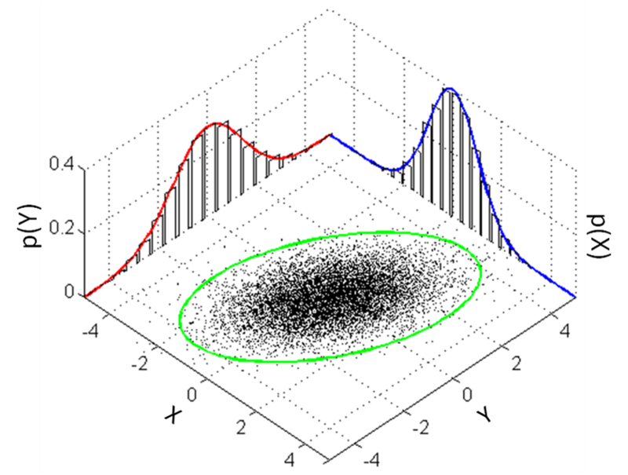
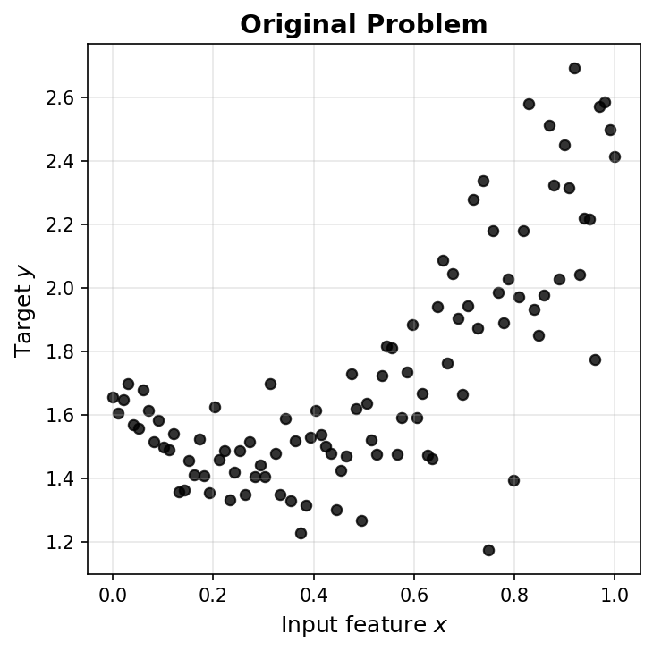
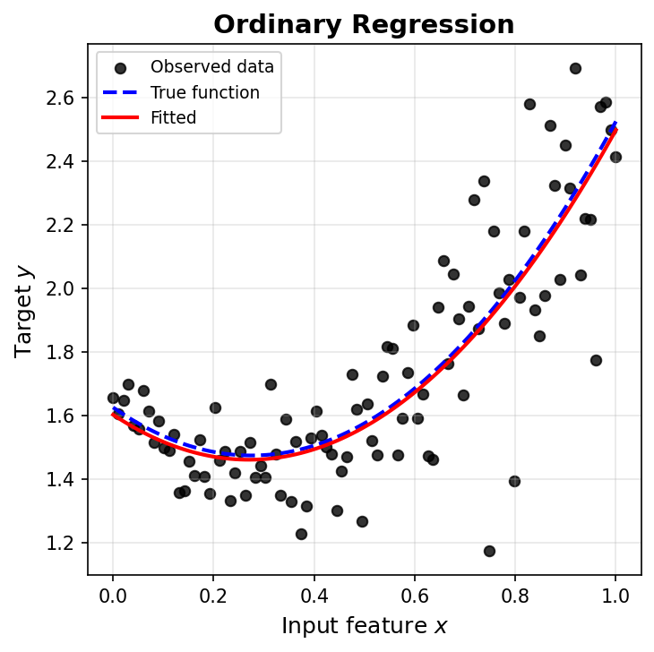
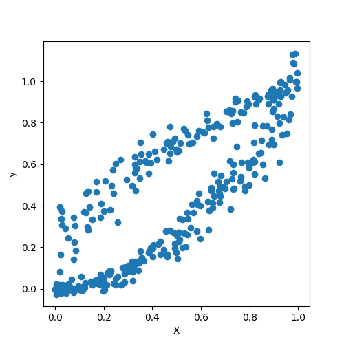
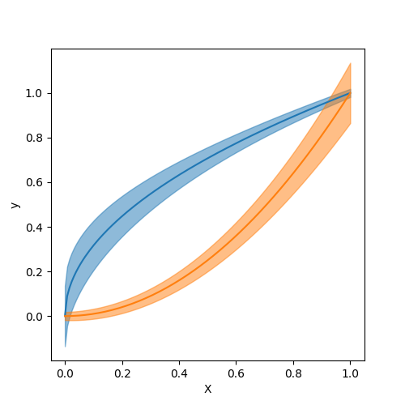

#  Machine Learning and Data Mining

~~~
\subtitle{Recapitulation}
\author{Maxim Borisyak}

\institute{Constructor University Bremen}

\usepackage{algorithm}
\usepackage{algpseudocode}
\usepackage{setspace}
\usepackage{framed}

\DeclareMathOperator*{\E}{\mathbb{E}}

\DeclareMathOperator*{\var}{\mathbb{D}}
\newcommand\D[1]{\var\left[ #1 \right]}

\newcommand\dmid{\,\|\,}

\DeclareMathOperator*{\argmin}{\mathrm{arg\,min}}
\DeclareMathOperator*{\argmax}{\mathrm{arg\,max}}
~~~

## Fundamentals of statistics

### Two schools of statistics

**Frequentist statistics**:
- probability = long-run frequency of events;
- parameters are fixed but unknown constants;
- inference based on sampling distributions;
- methods: MLE, hypothesis testing, confidence intervals.

**Bayesian statistics**:
- probability = degree of belief;
- parameters are random variables with distributions;
- inference via Bayes' theorem: $P(\theta \mid X) \propto P(X \mid \theta) P(\theta)$;
- methods: posterior distributions, credible intervals, MAP.

### Random variables

**Random variable**:
- a measurable function $X: \Omega \to \mathbb{R}$;
- maps outcomes from sample space to real numbers.

**Types**:
- **discrete**: $X \in \{x_1, x_2, \dots\}$;
  - probability mass function: $P(X = x)$;
  - examples: coin flip, die roll, number of defects;
- **continuous**: $X \in \mathbb{R}$;
  - probability density function: $p(x)$;
  - examples: height, temperature, measurement error.

### Random variables: discrete examples

**Discrete examples**:
- coin flip: $X \in \{0, 1\}$, $P(X = 1) = p$;
- die roll: $X \in \{1, 2, 3, 4, 5, 6\}$, $P(X = k) = 1/6$;
- number of customers per hour: $X \in \{0, 1, 2, \dots\}$.

**Properties**:
- finite or countably infinite outcomes;
- $\sum_x P(X = x) = 1$.

### Random variables: continuous examples

**Normal distribution**: $X \sim \mathcal{N}(\mu, \sigma^2)$

~~~equation*
p(x) = \frac{1}{\sqrt{2\pi\sigma^2}} \exp\left[-\frac{(x - \mu)^2}{2\sigma^2}\right]
~~~

**Examples**:
- person's height: $X \sim \mathcal{N}(170, 10^2)$ cm;
- measurement error: $X \sim \mathcal{N}(0, \sigma^2)$.

### Normal distribution: visualization

`{
  \footnotesize
  Source: \texttt{commons.wikimedia.org}
}`

### Multivariate normal distribution

**Multivariate normal**: $\mathbf{X} \sim \mathcal{N}(\boldsymbol{\mu}, \Sigma)$

~~~equation*
p(\mathbf{x}) = \frac{1}{(2\pi)^{d/2}|\Sigma|^{1/2}} \exp\left[-\frac{1}{2}(\mathbf{x} - \boldsymbol{\mu})^T\Sigma^{-1}(\mathbf{x} - \boldsymbol{\mu})\right]
~~~

where:
- $\mathbf{x} \in \mathbb{R}^d$ --- random vector;
- $\boldsymbol{\mu} \in \mathbb{R}^d$ --- mean vector: $\boldsymbol{\mu}_i = \E[X_i]$;
- $\Sigma \in \mathbb{R}^{d \times d}$ --- covariance matrix: $\Sigma_{ij} = \mathrm{Cov}[X_i, X_j]$;
- $|\Sigma|$ --- determinant of $\Sigma$.

### Multivariate normal: covariance matrix

**Covariance matrix** $\Sigma$:
~~~equation*
\Sigma_{ij} = \mathrm{Cov}[X_i, X_j] = \E[(X_i - \mu_i)(X_j - \mu_j)]
~~~

**Properties**:
- symmetric: $\Sigma = \Sigma^T$;
- positive semi-definite: $\mathbf{v}^T \Sigma \mathbf{v} \geq 0$ for all $\mathbf{v}$;
- diagonal elements: $\Sigma_{ii} = \var[X_i]$;
- off-diagonal: correlation between variables.

### Multivariate normal: special cases

**Independent components**: $\Sigma = \mathrm{diag}(\sigma^2_1, \dots, \sigma^2_d)$
~~~equation*
p(\mathbf{x}) = \prod^d_{i=1} \frac{1}{\sqrt{2\pi\sigma^2_i}} \exp\left[-\frac{(x_i - \mu_i)^2}{2\sigma^2_i}\right]
~~~

**Spherical (isotropic)**: $\Sigma = \sigma^2 I$
~~~equation*
p(\mathbf{x}) = \frac{1}{(2\pi\sigma^2)^{d/2}} \exp\left[-\frac{\|\mathbf{x} - \boldsymbol{\mu}\|^2}{2\sigma^2}\right]
~~~

### Multivariate normal: visualization

`{
  \footnotesize
  3D surface and contour plots of bivariate normal distribution. \\
  Source: \texttt{commons.wikimedia.org}
}`

### Random variables: expectation

**Expectation** (mean):
~~~equation*
\E[X] = \begin{cases}
  \sum_x x \cdot P(X = x) & \text{discrete}\\
  \int x \cdot p(x)\;dx & \text{continuous}
\end{cases}
~~~

**Variance**:
~~~eqnarray*
\var[X] &=& \E\left[(X - \E[X])^2\right]\\
&=& \E[X^2] - (\E[X])^2
~~~

### Statistical estimators

Given:
- sample: $X = \{x_1, \dots, x_n\}$ from distribution $P(x \mid \theta)$;
- unknown parameter: $\theta$.

**Estimator**: $\hat{\theta}(X)$ --- a function of sample.

**Examples**:
- sample mean: $\hat{\mu} = \frac{1}{n}\sum^n_{i=1} x_i$;
- sample variance: $\hat{\sigma}^2 = \frac{1}{n}\sum^n_{i=1}(x_i - \hat{\mu})^2$.

### Bias of an estimator

**Bias**:
~~~equation*
\mathrm{Bias}[\hat{\theta}] = \E[\hat{\theta}] - \theta
~~~

**Unbiased estimator**:
$$\E[\hat{\theta}] = \theta \quad \Leftrightarrow \quad \mathrm{Bias}[\hat{\theta}] = 0$$

### Asymptotically unbiased estimator

**Asymptotically unbiased**:
~~~equation*
\lim_{n \to \infty} \E[\hat{\theta}_n] = \theta
~~~

or equivalently:
~~~equation*
\lim_{n \to \infty} \mathrm{Bias}[\hat{\theta}_n] = 0
~~~

- bias vanishes as sample size grows;
- weaker condition than unbiasedness.

### Examples: biased vs unbiased

**Sample mean** for $\mu$:
$$\hat{\mu} = \frac{1}{n}\sum^n_{i=1} x_i$$
- $\E[\hat{\mu}] = \mu$ --- **unbiased**.

**Sample variance** for $\sigma^2$:
$$\hat{\sigma}^2 = \frac{1}{n}\sum^n_{i=1}(x_i - \hat{\mu})^2$$
- $\E[\hat{\sigma}^2] = \frac{n-1}{n}\sigma^2$ --- **biased**;
- asymptotically unbiased: $\lim_{n \to \infty} \E[\hat{\sigma}^2] = \sigma^2$.

### Unbiased sample variance

**Unbiased estimator** for $\sigma^2$:
~~~equation*
s^2 = \frac{1}{n-1}\sum^n_{i=1}(x_i - \hat{\mu})^2
~~~

then:
$$\E[s^2] = \sigma^2$$

- division by $n-1$ (Bessel's correction) accounts for using estimated mean;
- loses one degree of freedom.

### Example: asymptotically unbiased wins

Compare variance estimators (assuming $X_i \sim \mathcal{N}(\mu, \sigma^2)$):

**Unbiased**: $s^2 = \frac{1}{n-1}\sum^n_{i=1}(x_i - \bar{x})^2$
- $\E[s^2] = \sigma^2$;
- $\var[s^2] = \frac{2\sigma^4}{n-1}$.

**MLE (biased)**: $\hat{\sigma}^2 = \frac{1}{n}\sum^n_{i=1}(x_i - \bar{x})^2$
- $\E[\hat{\sigma}^2] = \frac{n-1}{n}\sigma^2$ --- biased;
- $\var[\hat{\sigma}^2] = \frac{2(n-1)\sigma^4}{n^2} < \var[s^2]$ --- **lower variance**!

### Example: asymptotically unbiased wins

**Comparison**:
~~~equation*
\frac{\var[\hat{\sigma}^2]}{\var[s^2]} = \frac{(n-1)^2}{n^2} \approx 1 - \frac{2}{n}
~~~

- MLE has ~$\frac{2}{n}$ less variance;
- bias: $\mathrm{Bias}[\hat{\sigma}^2] = -\frac{\sigma^2}{n} \to 0$;
- for large $n$: MLE dominates in MSE;
- tradeoff: small bias buys significant variance reduction.

### Counter example: unbiased but bad

**Estimator using only first element**:
$$\hat{\mu}_1 = x_1$$

For estimating $\mu = \E[X_i]$:
- $\E[\hat{\mu}_1] = \E[x_1] = \mu$ --- **unbiased**;
- $\var[\hat{\mu}_1] = \sigma^2$ --- does **not** decrease with $n$;
- **not consistent**: does not converge to $\mu$;
- wasteful: ignores $n-1$ observations.

### Counter example: comparison

Compare $\hat{\mu}_1 = x_1$ vs $\hat{\mu} = \frac{1}{n}\sum^n_{i=1} x_i$:

~~~center
\begin{tabular}{l|c|c}
Property & $\hat{\mu}_1$ & $\hat{\mu}$ \\
\hline
Unbiased & \checkmark & \checkmark \\
Variance & $\sigma^2$ & $\sigma^2/n$ \\
Consistent & $\times$ & \checkmark \\
MSE & $\sigma^2$ & $\sigma^2/n$
\end{tabular}
~~~

**Lesson**: unbiasedness alone is not sufficient for a good estimator.

### Mean Squared Error

**Mean Squared Error**:
~~~eqnarray*
\mathrm{MSE}[\hat{\theta}] &=& \E[(\hat{\theta} - \theta)^2]\\
&=& \mathrm{Bias}[\hat{\theta}]^2 + \var[\hat{\theta}]
~~~

**Bias-variance decomposition**:
- unbiased estimator may have high variance;
- slightly biased estimator may have lower MSE;
- fundamental tradeoff in machine learning.

### Example: biased but better MSE

**Estimating variance with shrinkage**:

Given $X_1, \dots, X_n \sim \mathcal{N}(\mu, \sigma^2)$, consider:
- unbiased: $s^2 = \frac{1}{n-1}\sum^n_{i=1}(x_i - \bar{x})^2$;
- biased: $\hat{\sigma}^2_c = \frac{1}{n+1}\sum^n_{i=1}(x_i - \bar{x})^2$.

For small $n$, $\mathrm{MSE}[\hat{\sigma}^2_c] < \mathrm{MSE}[s^2]$!

**Tradeoff**: accepting bias reduces variance enough to lower MSE.

### Consistency

**Consistent estimator**:
~~~equation*
\hat{\theta}_n \xrightarrow{P} \theta \quad \text{as } n \to \infty
~~~

i.e., $\forall \varepsilon > 0$:
$$\lim_{n \to \infty} P(|\hat{\theta}_n - \theta| > \varepsilon) = 0$$

- converges in probability to true parameter;
- weaker than unbiasedness (concerns large $n$ behavior).

### Example: inconsistent estimator

**Constant estimator**:
$$\hat{\mu}_0 = c \quad \text{(constant, independent of data)}$$

For estimating $\mu = \E[X_i]$:
- $\E[\hat{\mu}_0] = c$ --- biased (unless $c = \mu$ by chance);
- $\var[\hat{\mu}_0] = 0$ --- zero variance!
- **not consistent**: $\hat{\mu}_0 \not\to \mu$ as $n \to \infty$;
- does not use data at all.

**Another example**: we already saw $\hat{\mu}_1 = x_1$ is unbiased but inconsistent.

### Example: asymptotically unbiased but inconsistent

**Estimator with noise**:
~~~align
\hat{\mu}_\varepsilon = \frac{1}{2}\left[ \frac{1}{N} \sum^{N}_{i = 1} x_i + x_1 \right].
~~~

**Properties**:
- $\E[\hat{\mu}_\varepsilon] = \mu$ --- unbiased for all $n$;
- $P(|\hat{\mu}_\varepsilon - \mu| > \varepsilon) \not\to 0$.

### Example: consistent but biased

**Shrinkage estimator**:
$$\hat{\mu}_s = \frac{1}{N}\sum^{N}_{i = 1} x_i + \frac{c}{n}$$
where $c \neq 0$ is a constant.

**Properties**:
- $\E[\hat{\mu}_s] = \mu + \frac{c}{n}$ --- biased for all finite $n$;
- $\mathrm{Bias}[\hat{\mu}_s] = \frac{c}{n} \to 0$ --- asymptotically unbiased;
- $\hat{\mu}_s \xrightarrow{P} \mu$ --- **consistent**!
- shows: consistency ≠ unbiasedness for finite $n$.

## Statistical estimations

### Setup

Given:
- data: $X = \{ x_i \}^N_{i = 1}$;
- parameterized family of distributions $P(x \mid \theta)$.

Problem:
- estimate $\theta$.

### Maximum likelihood estimation

~~~eqnarray*
L(\theta) &=& P(X \mid \theta);\\
\hat{\theta} &=& \argmax_\theta L(\theta).
~~~

~~~equation*
\mathcal{L}(\theta) = -\log \prod_i P(x_i \mid \theta) = -\sum_i \log P(x_i \mid \theta)
~~~

- consistent estimation: $\hat{\theta} \to \theta$ as $N \to \infty$;
- *might be biased*;
- equal to MAP estimation with uniform prior.

### MLE: example

> Given samples $\{ x_i \}^N_{i = 1}$ from a normal distribution estimate its mean.

~~~multline*
  \mu = \argmin_\mu \mathcal{L}(X) = \\[3mm]
    \argmin_mu -\sum_i \log \left(\frac{1}{Z} \exp\left[ -\frac{(x_i - \mu) ^ 2}{2 \sigma^2}\right]\right) = \\[3mm]
    \argmin_\mu \sum_i (x_i - \mu) ^ 2 = \frac{1}{N} \sum_i x_i
~~~

### Properties of MLE

**Maximum Likelihood Estimator**:
$$\hat{\theta}_{\mathrm{MLE}} = \argmax_\theta P(X \mid \theta)$$

**Key properties** (under regularity conditions):

1. **Consistency**: $\hat{\theta}_{\mathrm{MLE}} \xrightarrow{P} \theta$ as $n \to \infty$;
2. **Asymptotic normality**: $\sqrt{n}(\hat{\theta}_{\mathrm{MLE}} - \theta) \xrightarrow{d} \mathcal{N}(0, I(\theta)^{-1})$;
3. **Asymptotic efficiency**: achieves Cramér-Rao lower bound.

### Properties of MLE: bias

**MLE is generally biased**:
- $\E[\hat{\theta}_{\mathrm{MLE}}] \neq \theta$ for finite $n$;
- **asymptotically unbiased**: $\lim_{n \to \infty} \E[\hat{\theta}_{\mathrm{MLE}}] = \theta$;
- bias often decreases as $O(1/n)$.

**Example**: MLE for variance $\sigma^2$ in normal distribution:
$$\hat{\sigma}^2_{\mathrm{MLE}} = \frac{1}{n}\sum^n_{i=1}(x_i - \hat{\mu})^2$$
is biased but asymptotically unbiased.

### Properties of MLE: efficiency

**Fisher Information**:
~~~equation*
I(\theta) = \E\left[\left(\frac{\partial \log P(X \mid \theta)}{\partial \theta}\right)^2\right]
~~~

**Cramér-Rao bound**:
$$\var[\hat{\theta}] \geq \frac{1}{n \cdot I(\theta)}$$

**Asymptotically efficient**:
- MLE achieves this bound as $n \to \infty$;
- no other consistent estimator has lower asymptotic variance.

### Properties of MLE: invariance

**Functional invariance**:

If $\hat{\theta}_{\mathrm{MLE}}$ is MLE for $\theta$, then for any function $g$:
$$\widehat{g(\theta)}_{\mathrm{MLE}} = g(\hat{\theta}_{\mathrm{MLE}})$$

**Example**:
- MLE for $\mu$ in $\mathcal{N}(\mu, \sigma^2)$: $\hat{\mu} = \bar{x}$;
- MLE for $\mu^2$: $\widehat{\mu^2} = \bar{x}^2$ (not $\overline{x^2}$).

### Bayesian inference

~~~equation*
  P(\theta \mid X) = \frac{1}{Z} P(X \mid \theta) P(\theta);
~~~

- often, posterior distribution of predictions is of the main interest:
  $$P(f(x) = y \mid X) = \int \mathbb{I}\left[ f(x, \theta) = y \right] P(\theta \mid X)\;d\theta$$
- with a few exceptions posterior is intractable;
- often, approximate inference is utilized instead.

### BI: example

> Given samples $\{x_i\}^N_{i = 1}$ from a normal distribution estimate mean under a normal prior.

~~~multline*
  P(\mu \mid X) = \frac{1}{Z} P(X \mid \mu) P(\mu) = \\
    \frac{1}{Z} \exp\left[ -\frac{\mu ^ 2}{2 c^2}\right] \cdot \prod \exp\left[ -\frac{(x_i - \mu) ^ 2}{2 \sigma^2}\right]
~~~

`\vspace*{5mm}`

~~~equation*
  \log P(\mu \mid X) = -Z -\frac{\mu ^ 2}{2 c^2} -\sum_i \frac{(x_i - \mu) ^ 2}{2 \sigma^2}
~~~

### Maximum a posteriori estimation

~~~multline*
  \hat{\theta} = \argmax_\theta P(\theta \mid X) =
    \argmax_\theta P(X \mid \theta) P(\theta) =\\
    \argmin_\theta \left[  -\log P(X \mid \theta) - \log P(\theta) \right] = \\
    \argmin_\theta \left[  \mathrm{neg\;log\;likelihood} + \mathrm{penalty} \right]
~~~

~~~equation*
\hat{\theta} = \argmin_\theta \left[ -\log P(\theta) - \sum_i \log P(x_i \mid \theta)\right]
~~~

- sometimes called **structural loss**:
  - i.e. includes 'structure' of the predictor into the loss.

### MAP: example

> Given samples $\{x_i\}^N_{i = 1}$ from a normal distribution estimate mean under a normal prior.

~~~multline*
  \hat{\mu} = \argmax_\mu \log P(\mu \mid X) = \\
    \argmax_\mu \left[ -Z -\frac{\mu ^ 2}{2 c^2} - \sum_i \frac{(x_i - \mu) ^ 2}{2 \sigma^2} \right] = \\
    \argmin_\mu \left[ \lambda \mu ^ 2 + \sum_i (x_i - \mu) ^ 2 \right] =
    \frac{1}{N + \lambda} \sum_i x_i
~~~

## Machine Learning

### Structure of a Machine Learning problem

Given:
- description of the problem:
  - prior knowledge;
- data:
  - input space: $\mathcal{X}$;
  - output space: $\mathcal{Y}$;
- metric $M$.

Problem:
- find a learning algorithm: $A: \mathcal{D} \to (\mathcal{X} \to \mathcal{Y})$ such that:
  $$M(A(\mathrm{data})) \to \max$$

### Differences from statistics

Machine Learning:
- distributions are often intractable;
- high-dimensionality/small sample sizes;
- **universal approximators**;
- solves direct problem.

***[T]

Statistics:
- process modelling;
- low-dimensionality/large sample sizes;
- (approx.) prob. distributions;
- **exact inference**;
- infers process parameters.

## Supervised learning

### Regression

Input: $x \in \mathbb{R}^n$:
- samples;
- features;
- inputs;
- predictor (statistics).

Output: $y \in \mathbb{R}^m$:
- target;
- label;
- response.

***

### (Ordinary) Regression

Given a sample from:
~~~align*
& y = \hat{f}(x) + \varepsilon;\\
& \varepsilon \sim P(\varepsilon \mid x);\\
& \E \left[ \varepsilon \mid x \right] = 0.
~~~

find a model $m(x)$ such that:
~~~align*
m(x) \approx \E\left[y \mid x\right] = \hat{f}(x).
~~~

***

### General Regression

Given a sample from:
~~~align*
& y = P(y \mid x);
~~~
find a model $Q(y \mid x)$ such that:
~~~align*
Q(y \mid x) \approx P(y \mid x).
~~~

***

### Regression loss

~~~multline*
  \mathcal{L}(f) =
    -\sum_i \log P_y(y_i \mid f, x_i) =\\
    -\sum_i \log P_\varepsilon(y_i - f(x_i) \mid f, x_i) =\\
    -\sum_i \log P_\varepsilon(y_i - f(x_i) \mid x_i)
~~~

### Regression: MSE

- $\varepsilon \sim \mathcal{N}(0, \sigma^2_\varepsilon)$;
- $\sigma^2_\varepsilon = \mathrm{const}$ (unknown);

~~~multline*
  \mathcal{L}(f) = -\sum_i \log P_\varepsilon(y_i - f(x_i) \mid x_i) = \\
    \sum_i \left[ Z(\sigma^2_\varepsilon) - \frac{(y_i - f(x_i))^2}{2 \sigma^2_\varepsilon}\right] \sim \\
    \sum_i (y_i - f(x_i))^2 \to \min
~~~

~~~equation*
  f^*(x) = \E\left[ y \mid x \right]
~~~

### Regression: MSE

~~~center
MSE always recovers the mean in the limit of infinite data.\\
Not always as efficient of MLE.
~~~
~~~multline*
\mathcal{L}(f) = \E \left[ \left(y - f\left(x\right)\right)^2\;\middle|\; x \right] = \\
  \E \left[ y^2 - 2 y\,f(x) + f^2(x) \;\middle|\; x \right] = \\
  \E \left[ y_c^2 - 2 y_c \mu(x) - 2 y_c\,f(x) + f^2(x) - 2 \mu(x) f(x)  + \mu^2(x) \;\middle|\; x \right] = \\
    \sigma^2 + 0 + 0 +  \E \left[\left(f(x) - \mu(x)\right)^2 \;\middle|\; x \right] 
~~~
where:
- $y_c = y - \E y = y - \mu$;

### Regression: MAE

- $\varepsilon \sim \mathrm{Laplace}(0, b_\varepsilon)$;
- $b_\varepsilon = \mathrm{const}$ (unknown);

~~~multline*
  \mathcal{L}(f) = -\sum_i \log P_\varepsilon(y_i - f(x_i) \mid x_i) = \\
    \sum_i \left[ Z(b_\varepsilon) - \frac{|y_i - f(x_i)|}{2 b_\varepsilon}\right] \sim \\
    \sum_i |y_i - f(x_i)| \to \min
~~~

~~~equation*
  f^*(x) = \mathrm{median}\left[ y \mid x \right]
~~~

### Linear regression

$$f(x) = w \cdot x$$

`\footnotetext[1]{For clarity we omit the bias term as it can be included by appending 1 to every sample.}`

### Linear regression + MSE + MLE

~~~eqnarray*
  \mathcal{L}(w) &=& \sum_i (w \cdot x_i - y_i) ^ 2 = \|X w - y\|^2 \to \min;\\
  \frac{\partial}{\partial w}\mathcal{L}(w) &=& 2 X^T (X w - y) = 0;\\
  w &=& (X^T X)^{-1} X^T y.
~~~

### Linear regression + MSE + MAP

~~~eqnarray*
  \mathcal{L}(w) &=& \sum_i (w \cdot x_i - y_i) ^ 2 + \lambda \|w\|^2 =\\
    && \|X w - y\|^2 + \lambda \|w\|^2\to \min;\\
  \frac{\partial}{\partial w}\mathcal{L}(w) &=& 2 X^T (X w - y) + 2 \lambda w= 0;\\
  w &=& (X^T X + \lambda I)^{-1} X^T y.
~~~

### Linear regression + MSE + Bayesian Inference

- prior:
  $$w \sim \mathcal{N}(0, \Sigma_w);$$
- data model:
  $$\varepsilon \sim \mathcal{N}(0, \sigma^2_\varepsilon).$$

### Linear regression + MSE + Bayesian Inference

~~~multline*
P(w \mid y, X) \propto P(y \mid w, X) P(w) \propto \\[3mm]
  \exp\left[ - \frac{1}{2 \sigma^2_\varepsilon} (y - X w)^T (y - X w) \right] \cdot \exp\left[ -\frac{1}{2} w^T \Sigma^{-1}_w w \right] = \\[3mm]
  \exp\left[ - \frac{1}{2} (w - w^*)^T A_w (w - w^*) \right]
~~~

where:
- $A_w = \frac{1}{\sigma^{2}_\varepsilon}X X^T + \Sigma^{-1}_w$;
- $w^* = \frac{1}{\sigma^{2}_\varepsilon} A^{-1}_w X y$.

### Linear regression + MSE + Bayesian Inference

To make prediction $y'$ in point $x'$:

~~~multline*
P(y' \mid y, X, x') = \\
  \int P(y' \mid w, x') P(w \mid X, y) = \\
  \mathcal{N}\left( \frac{1}{\sigma^2_\varepsilon} x'^T A^{-1} X y, x'^T A^{-1} x' \right)
~~~

### Basis expansion

To capture more complex dependencies basis functions can be introduced:
$$f(x) = \sum_i w \cdot \phi(x)$$

where:
- $\phi(x) \in \mathbb{R}^K$ --- expanded basis.
- $\phi$ **is fixed**.

### Basis expansion: example

Regression with polynomials:
$$\phi(x) = \{1, x_1, \dots, x_n, x^2_1, x_1 x_2, \dots, x^2_n, \dots\}$$

Periodic functions:
$$\phi(x) = \{1, \sin(x), \cos(x), \sin(2x), \cos(2x), \dots\}$$

### Basis expansion: example

`{
  \footnotesize
  Source: \texttt{eric-kim.net}
}`

### Classification

- classes: $y \in \{1, 2, \dots, m\}$;
- classifier:

~~~eqnarray*
  f: \mathcal{X} \to \mathbb{R}^m;\\
  \sum^m_{k=1} f^k(x) = 1.
~~~

~~~eqnarray*
  \mathcal{L}(f) = -\sum_i \sum^m_{k = 1} \mathbb{I}[y_i = k]\log f^k(x_i);\\
  \mathrm{cross\text{-}entopy}(f) = \sum_i y'_i \cdot f(x_i).
~~~

### Softmax

- often employed trick to make $f(x)$ a proper distribution:

~~~eqnarray*
f(x) &=& \mathrm{softmax}(g(x));\\[5mm]
f^i(x) &=& \frac{\exp(g^i(x))}{\sum_k \exp(g^k(x))}.
~~~

### Logistic regression

~~~eqnarray*
  g(x) &=& W x + b;\\
  f(x) &=& \mathrm{softmax}(g(x)).
~~~

Another form:

~~~eqnarray*
  \frac{\log P(y = i \mid x)}{\log P(y = j \mid x)} = \frac{w_i \cdot x + b_i}{w_j \cdot x + b_j}
~~~

### Logistic regression: 2 classes

~~~multline*
  f_1(x) = \frac{\exp(w_1 \cdot x + b_1)}{\exp(w_1 \cdot x + b_1) + \exp(w_2 \cdot x + b_2)} =\\[5mm]
    \frac{1}{1 + \exp((w_2 - w_1) \cdot x + b_2 - b_1)} =\\[5mm]
    \frac{1}{1 + \exp(w' \cdot x + b')} = \\[5mm]
    \mathrm{sigmoid}(w' \cdot x + b').
~~~

### Logistic regression: 2 classes

### Training logistic regression

~~~multline*
  \mathcal{L}(w) = \\
  \sum_i \mathbb{I}[y_i = 1] \log (1 + \exp(w x_i + b)) + \mathbb{I}[y_i = 0] \log (1 + \exp(-w x_i - b))
~~~

- has no analytical solution;
- smooth and convex.

### Gradient Descent

~~~eqnarray*
f(\theta) \to \min;\\
\theta^* = \argmin_\theta f(\theta).
~~~

~~~eqnarray*
  \theta^{t + 1} &=& \theta^t - \alpha \nabla f(\theta^t);\\
  \theta^t &\to& \theta^*, t \to \infty;\\
~~~

### Gradient Descent

~~~framed
\begin{spacing}{1.75}
\begin{algorithmic}[1]
  \State $\theta := \text{initialization}$
  \For{$t := 1, \dots$}
    \State $\theta := \theta - \alpha \nabla f(\theta^t)$
  \EndFor
\end{algorithmic}
\end{spacing}
~~~

### Stochastic Gradient Descent

$$f(\theta) = \sum^N_{i = 1} f_i(\theta)$$

~~~framed
\begin{spacing}{1.75}
\begin{algorithmic}[1]
  \State $\theta := \text{initialization}$
  \For{$t := 1, \dots$}
    \State $i := \mathrm{random}(1, \dots, N)$
    \State $\theta := \theta - \alpha \nabla f_i(\theta^t)$
  \EndFor
\end{algorithmic}
\end{spacing}
~~~

### Illustration

`{
  \footnotesize
  Source: \texttt{towardsdatascience.com}
}`

### Tricky example

### Tricky example

### ...

`{
  \footnotesize
  Source: \texttt{xkcd.com}
}`

## My first neural network

### Universal Approximators

`\begin{block}{Universal Approximation Theorem}`
  If $\phi$ is a non-constant, continuous, bounded, monotonic function, then every continuous function $f$ on a compact set from $\mathbb{R}^n$
  can be approximated with any precision $\varepsilon > 0$ by:
    $$g(x) = c + \sum^N_{i = 1} \alpha_i \phi(w_i \cdot x + b_i)$$
  given large enough $N$.
`\end{block}`

### Universal Approximators

### How to train a neural network

Stochastic Gradient Descent and Co.

### How to train a neural network

Stochastic Gradient Descent and Co.

- how to initialize?
- how to choose an appropriate learning rate?
- how many units?
- which activation function to choose?
